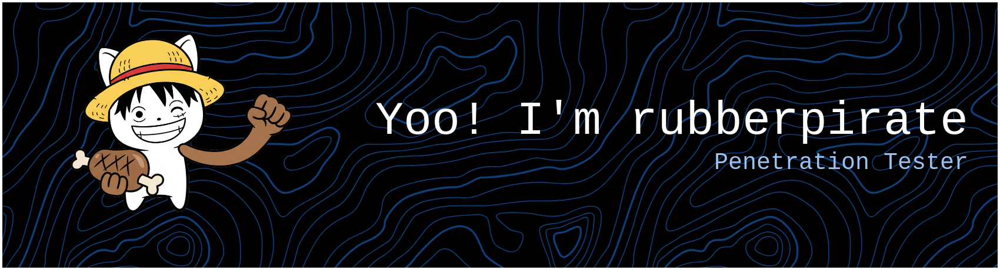

  

 

### ⚡ About Me

I'm **Rahul Rajith** (aka `@rubberpirate`), a developer passionate about **Cybersecurity**, **Automation**, and **System Administration**. I enjoy breaking things to see how they work, building automation scripts.

---

### 🛠️ Languages & Tools

  
    

  
    
  
  

---

   
  
  

---

  
  
  
  
  
  

    
  
  

###

<picture>
  <source media="(prefers-color-scheme: dark)" srcset="https://raw.githubusercontent.com/rubberpirate/rubberpirate/output/pacman-contribution-graph-dark.svg">
  <source media="(prefers-color-scheme: light)" srcset="https://raw.githubusercontent.com/rubberpirate/rubberpirate/output/pacman-contribution-graph.svg">
  
</picture>

  

  

